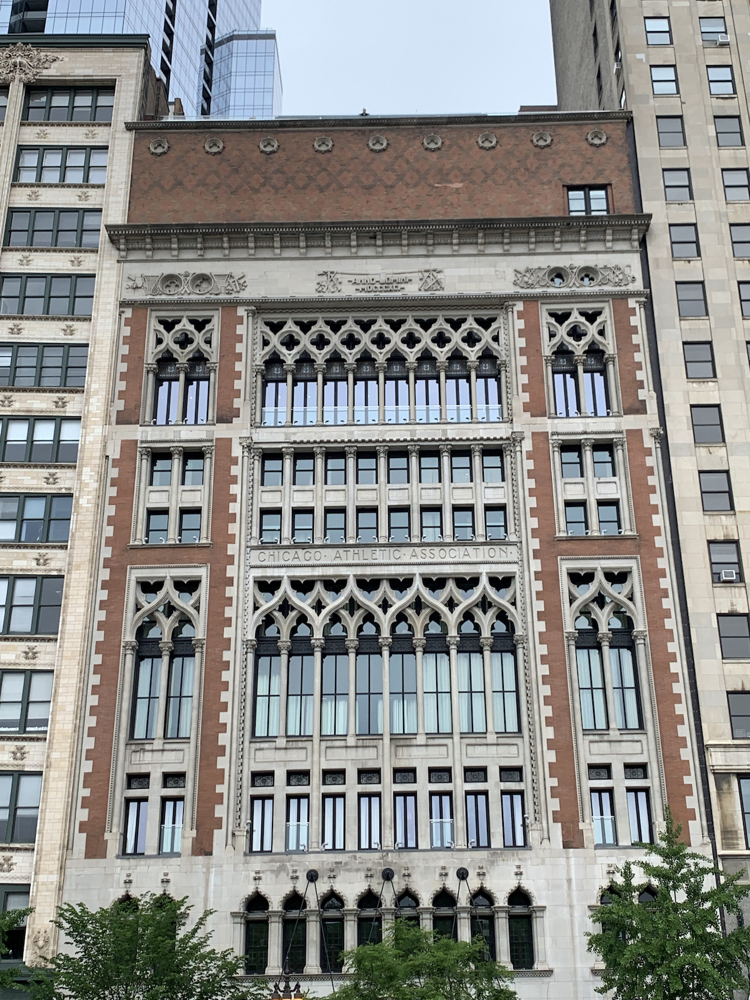

2022 年６月、シカゴへ行ってきました。目的はシカゴ美術館。たまたま開催されていた Blues Festival も観ることができて最高でした。

### 1 日目

この日は移動のみ。最寄のサンフランシスコ空港を午後出発の便だったのでのんびり支度。昼過ぎに家を出発。飛行機は満席でした。直行便ではなくデンバー経由。ロッキー山脈あたりで揺れに揺れ、生きた心地がしませんでした。夜 11 時過ぎシカゴ着。Lyft でホテルへ。Embasy Suite 泊。

### 2 日目

9 時過ぎに起床。ホテルの無料朝食をカフェでいただく。内容はいたって普通。コーヒーいまいち。10 時半にホテルを徒歩で出発し、11 時からのアーキテクチャー徒歩ツアーに参加。予想を裏切る曇天で寒いくらい。シカゴのさまざまな建造物のレクチャーを受ける。他のアメリカの大都市と同様、古い建物と新しいビルが混在している。私が知っていたのはシアーズタワーくらいでした。

ツアー終了後、ランチをする場所を探すが、ネットで出てくるいいお店はいっぱいか休みかのどちらか。ツアーで結構歩いて足が疲れていたので、どこでもいいやということで、ツアー中に案内された [Chicago Athletic Hotel](https://www.chicagoathletichotel.com/) の２階にあるラウンジでシカゴホットドッグをいただきました。ラウンジの窓や装飾は時代を感じさせるクラッシックなもので、ゆっくりコーヒーを飲みながら素敵なひとときを過ごせました。ウェイトスタッフの方々も親切で感じがよかったです。

2 時過ぎに Blues Festival の会場であるミレニアルパークへ。もうすぐ始まるというのにステージ前の席はガラガラ。よく見えるところに陣取って開始を待ちました。こういうジャンルの音楽が大好きな夫氏は興奮気味。全然詳しくない私も、コロナで長らくライブな雰囲気を味わっていなかったので自然とワクワクしてました。

かなり寒かったけどビールを飲みながらライブを堪能。周囲のお客さんたちもノリノリでした。やっぱりいいですね。6 時くらいまでいて、お腹がすいてきたのでライブ会場を後に晩御飯を食べに行くことにしました。といっても何の下調べもしていなく、あてもなくホテル方向にブラブラ歩きながらよさそうなお店を探しました。日曜日だったのでやはりいいお店は予約なしでは厳しい。結局あきらめて飲茶も提供している中華に入りました。

ホテルに戻ってこの日は終了。

