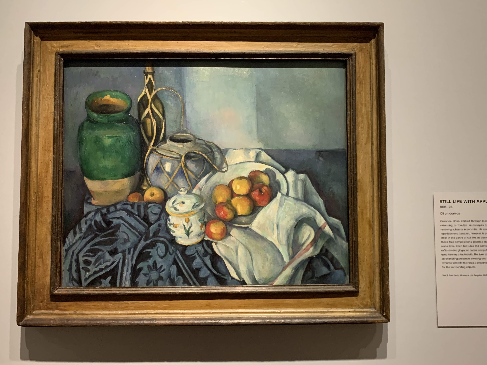
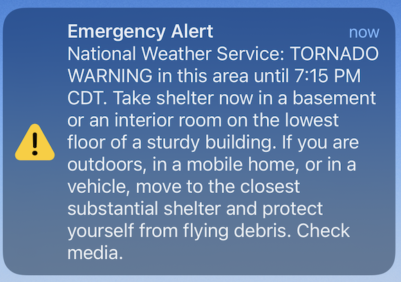
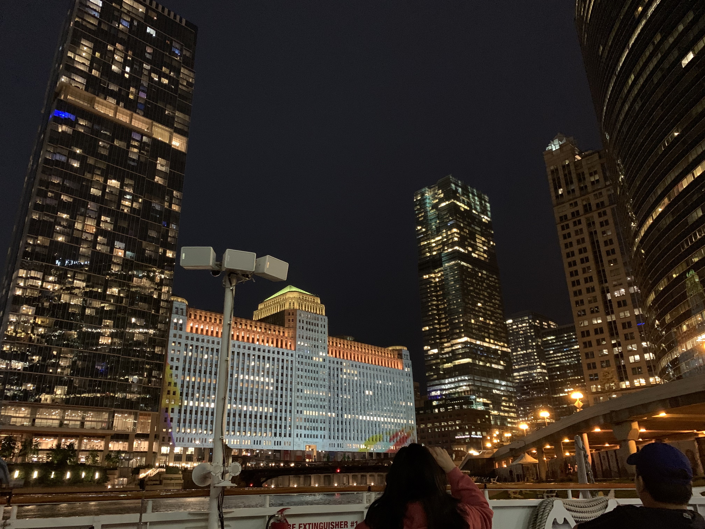
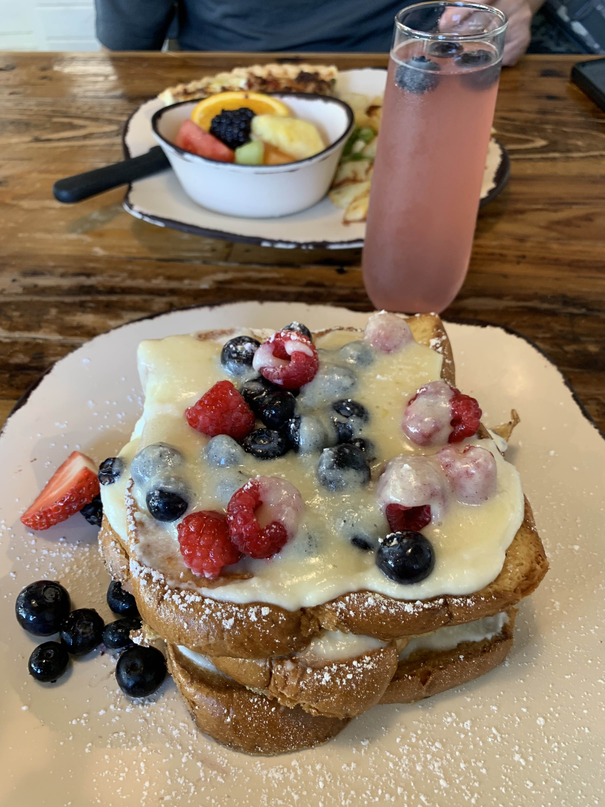

2022 年６月、シカゴへ行ってきました。目的はシカゴ美術館。たまたま開催されていた Blues Festival も観ることができて最高でした。

### 3 日目

ホテルのカフェからコーヒーだけもらってきて、朝は部屋でまったり。前日のものとは違う豆だったようで、今日のコーヒーは中炒りの私好み。前の晩のディナーがいまいちだったので、朝ごはんはどこかよさげなところで食べようということになりました。Yelp でホテル付近を Magnificent Mile エリアを検索。数ブロックという近さでレビューもよかった　 Kanela に行ってみましたが、あいにく満席で待っている人がたくさん。そこはあきらめて歩いてくるときに見えた [Cupitol Coffee](https://cupitol.com/) に行きました。元は倉庫っぽかった空間ですが、白を基調にしているので中は明るくて、なかなか居心地がよさそうなカフェでした。コーヒー屋さんだと思って入りましたが、朝ご飯アイテムも充実していました。私はコーヒーとアボカドラップで軽く。夫氏はスムージーとベーグル。

朝ご飯を終えると、そこからシカゴ川を渡って The Loop エリア目指して歩きました。前日とはうってかわって暑い 1 日です。目指すのはシカゴ美術館（[The Art Institute of Chicago](https://www.artic.edu/))です。平日だったのでその場でチケットを買ってすぐに入場できました。名作揃いで有名なので一度は行ってみたいと思っていました。どの絵も側まで近寄れるし、フラッシュを使わなければ写真も撮り放題。太っ腹です。期間限定でセザンヌ展をやっていました。全ての作品を見るには 1 日では足りないと言われていますが、残念ながら半日しかなかった私たちは絶対に見たいエリアだけを重点的に回りました。

何時間も館内を歩き回り、ヘトヘトに疲れました。ディナーの前に少し時間があったので、前日のアーキテクチャーツアーで案内された [Palmer House Hotel](https://www.palmerhousehiltonhotel.com/) のラウンジで一休みしました。見上げた天井の装飾が素晴らしかったです。

この日はディナーを予約していきました。ホテル近くのイタリアン [Volare](https://www.volarerestaurant.com/)。前日お店の前を通った時に庶民的でよさそうだなと目を付けていました。思った通り気さくだけどちょっとだけ特別感もあるようないい雰囲気でした。値段も思ったよりリーズナブル。メインディッシュの多くが 25 ドルから 30 ドルくらい。前菜にサラダと小皿のミートボール、メインは私はサーモン、夫氏はイカ墨パスタを頼みました。サーモンはしっとりジューシーで大当たり。イカ墨のほうはソースの量が多くてなんだかもったりしてグラタンみたい。肝心のイカ墨を練り込んだパスタの存在感が薄いなと感じました。

食事を終えてホテルへ急ぎました。食事中に携帯のアラートが鳴り、何事かと思ったらトルネード警報でした。生まれて初めてです、トルネード警報を見たのは。他のお客さんの電話も鳴っていましたが、チラっと見ただけで気にする人は皆無。その様子だとトルネードに遭遇する心配はなさそうですが、それでも雷雨注意報が出ていたのでいったんホテルに引き上げ、その後予約していたリバークルーズの時間になるまで待機することにしました。ホテルの部屋にいる間にものすごい雷雨がありました。高層ビルの間を走る稲妻はちょっとした光のショーみたいでした。クルーズの時間が近づいてきましたが、雨脚が弱まる気配はありません。どっちみちこの雨では出航できないでしょうから、じっとやむのを待ちます。やっと止んだところでホテルを出発し、乗り場へ急ぎました。やはり私たちが予約した便は中止になり、次の 8 時台の便に振り替えになりました。

夜のリバークルーズは夜景が最高でした。さまざまなビルを川のほうから見上げるというのは新鮮で、とても楽しかったです。案内のおにいさんは声が通っていて聞きやすく、話がとても上手でした。それもそのはず、本職は俳優だそうです。船の上にはバーもあって飲み物も販売しています。残念ながら私たちはディナーで飲んできてしまっていたのでやめておきましたが、船上で夜風に吹かれてカクテルを飲みながら夜景を楽しんだら最高だろうなと思いました。

### 4 日目

この日は昼の便で帰るのみです。もう観光する時間はなかったのでホテル近くのおしゃれ系カフェ[Egg Harbor](https://eggharborcafe.com/location/streeterville/)でゆっくりブランチしました。ホテルから近くてちゃんとしたコーヒーが飲めるという理由で選んだお店ですが、メニューの多さにびっくり。あれこれ迷ってしまってなかなか決めるのにえらく時間がかかってしまいましたが、結局マスカルポーネチーズクリームがけフレンチトーストをいただきました。おいしかったです。

短かったシカゴの旅はこれでおしまいです。
