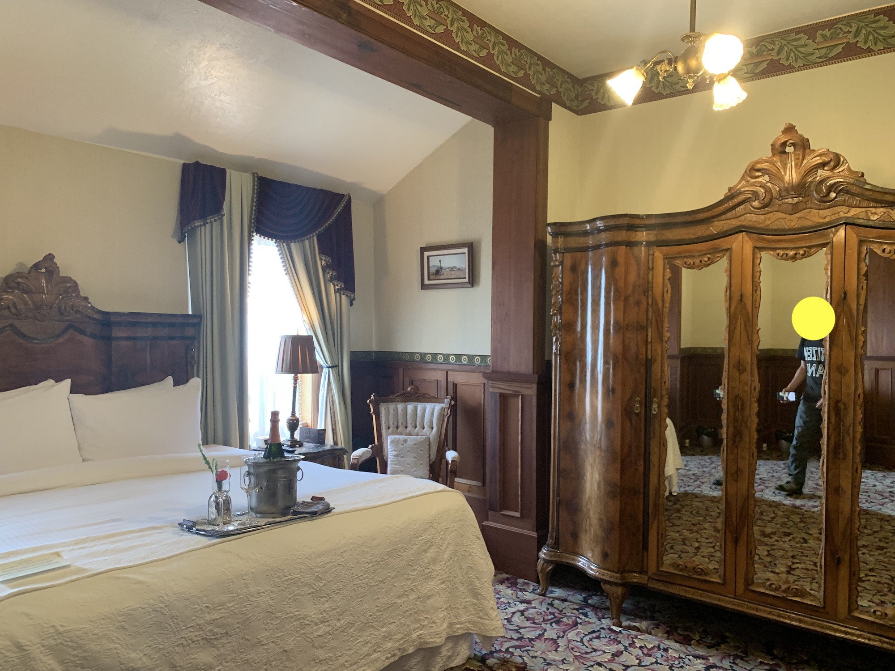

<section className="mdx-page">

2022 年 7 月、カリフォルニア州北部の海辺の街ユーリカへ行きました。特に有名な観光地ではないのですが、単に行ったことのないところに行こうというゆるい理由で行ってみました。

SF ベイエリアからハイウェイ 101 をひたすら北に向かって走ります。その日は独立記念日翌日で仕事を休んでいる人が多かったのか、道はガラガラ。いくつか山を越えて遠足気分でユーリカまで快適に走れました。

ユーリカの第一印象は、、、古い、暗い、汚い。空はどんよりしていたし、平日の午後だったためか街中は人気がなく閑散としてたせいかもしれません。ところどころにホームレスの方はお見かけしたのですが、びっしり路駐された車の数の割に人がいないのがなんとも不思議でした。昔は林業で栄えたということですが、今はなんというか、静かな海辺の田舎街という風情です。

とりあえず予約しておいたホテル[INN AT 2ND and C](https://www.theinnat2ndandc.com)へ。1888 年に建てられた街一番の由緒あるホテルです。ビクトリア調の４階建で、昔の映画に出てきそうなそれはそれは素敵な建物でした。部屋の家具は当時からのものだそうで、どれも手が込んだアンティーク。窓からの眺めはよくなかったけど大満足でした。このホテルに泊まれただけでもわざわざユーリカまで来た甲斐がありました。

ユーリカの街自体はこじんまりとしていて、だいたい歩いて見られます。晴れた日ならきっと海辺の散歩が気持ちいいのでしょうね。

夕食は、ぶらぶらしながら見つけた[The Sea Grill](https://seagrilleureka.com/)。ここも歴史を感じさせるビクトリアンのすてきな建物。インテリアはゴージャスだけどまったくきどってないところが私好み。味もサービスもよかったです。

食事を終えてホテルに戻る途中、いい感じのジャズが聴こえてきて、夫氏は自動的に吸い寄せられていってしまいました。[The Speakeasy](https://www.yelp.com/biz/the-speakeasy-eureka)というバーのパティオで、ジャズバンドが生演奏していたのでした。飲み物を買ってバンドの目の前に陣取り、最後まで楽しみました。こんな上手な人たちがこんなところで？　こんなすばらしい演奏をタダで聴いちゃっていいの？　というのが私たちの正直な感想でした。

そんなわけで私たちのユーリカ旅行は結果的に大満足で終わったのでした。

</section>
