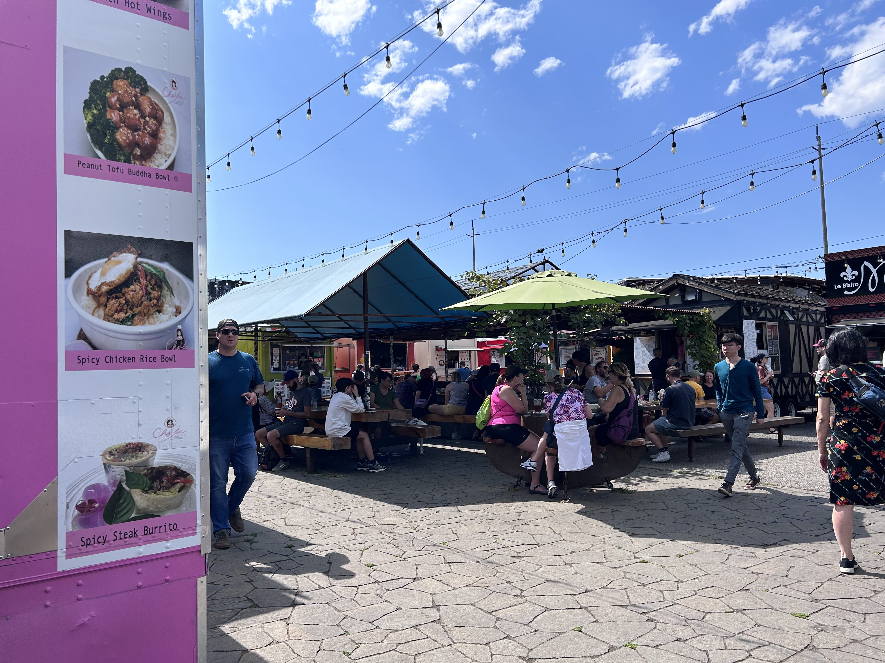
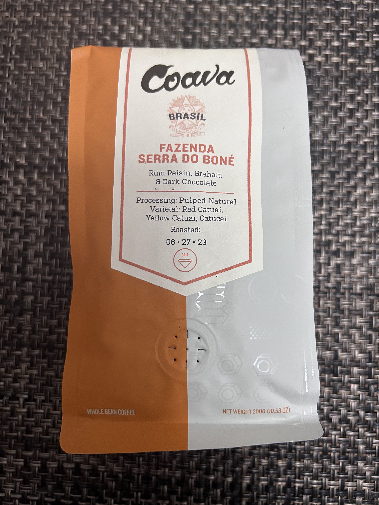

2023 年 9 月、オレゴン州ポートランドを訪れました。ポートランドは二度目です。コーヒーとビールがおいしくて、食のレベルも高いという評判の街で、別の州からわざわざ移り住む人も増えているとか。実は前回来た時、夫がポートランドを気に入ってかなり本気で家を買いたいと言い張りました。私はポートランドの知人から「雨が多くてうつっぽくなる」と聞いていたので反対しました。それが今回来た時は、私もポートランドの空気感というかバイブに魅了されてしまい、住んでみたいと思うようになりました。夫が買いたいと言った時に家を買っておけば、と激しく後悔。今は家の値段は格段に上がってしまい、気軽に引っ越せる場所ではなくなってしまいました。

今回泊まったホテルはイーストサイドにあるモダンな[Jupiter NEXT](https://www.jupiterhotel.com/the-next)。ミニマルだけど機能的で窓からの街の眺めもよくて気分よく滞在できました。１階にあるバーがなぜか人気らしくて、夕方からひっきりなしに人が集まっていました。私は１杯飲んだだけだったけど、女性バーテンダーさんがカッコよかった。

今回の旅のテーマは食。ということで街中のおいしいものが集まるフードカートへ行きました。市内のあちこちにいくつかあるのですが、私たちが訪れたのは[Howthorne Asylum](https://www.facebook.com/people/Hawthorne-Asylum-Food-Carts/100063610740747/)というサウスイーストエリアに4年前にオープンしたところです。フードカートというのは屋台の店が集まって毎日同じ場所で営業している感じです。フードコートは一般的にチェーン店が出店していて、グルメな人はあまり行かない印象。フードカートは旬なおいしい店が集まっていてフーディー向けと言えます。SFベイエリアではこのジャンルはフードトラックがになっていると思うのですが、あちこち移動するので、その点フードカートはいいですね。どれを食べるか迷いに迷ったのですが、バーベキューとウクライナ風ラビオリのような料理をいただき、どちらも最高においしかった。（痛恨の写真撮り忘れ）

フードカートでランチを済ませた後、ぜひ行きたかったコーヒーロースター[Coava](https://coavacoffee.com/)へ。私はコーヒーがないと生きられないコーヒー中毒者です。がぶ飲み用はトレジョの安いブレンド（でも決して悪くない）ですが、ゆったりコーヒータイムを楽しみたい時用にいい豆も買います。前回ポートランドに来た時は Stumptown にお邪魔したのですが、こちらのコーヒーはうちの近所のスーパーでも普通に買えるようになったので今回はパス。Coavaではシンプルに味を楽しめるようにドリップコーヒーをブラックでいただきました。浅煎りで香りがたっていてとてもおいしかったです。家で飲むためにシングルオリジンを２種類（東ティモールとブラジル）を購入。ちなみに帰るとき空港のセキュリティでスーツケースを思い切り開けられ、この２パックのコーヒー豆は念入りに調べられました。

夕食は[Afuri](https://afuri.us/)という日本食レストランへ。なぜポートランドでわざわざ日本食にしたかというと、ポートランドに引っ越したい気持ちがけっこう本格的になってきて、もし住んだらたまにはおいしい日本料理が食べられるのかどうかを確かめたかったからです。焼き鳥もお寿司も注文したものはすべておいしかったです。日本の味が恋しくなったときもこれでだいじょうぶ。

旅行から帰ってきて、ポートランドに引っ越すためには、まず今の家を片付けないといけないということに気づきました。長年住んでいるのでガラクタの宝庫です。夫も私は片付けが苦手なので、引っ越しはいつになるかわかりません。

