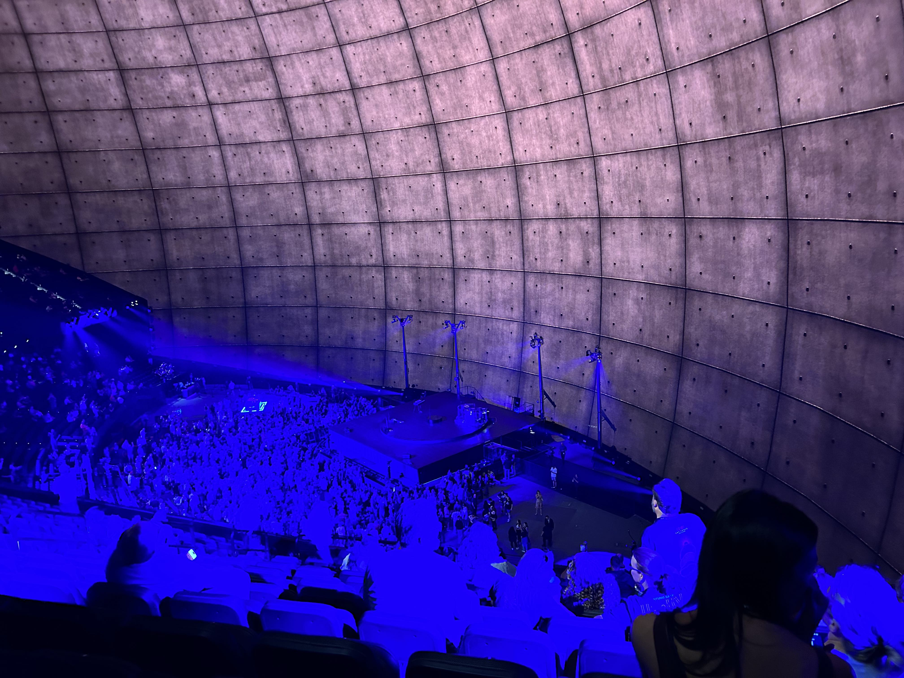

2023年9月29日、ラスベガスにオープンした球形シアター・スフィアでU2のコンサートを観てきました。[Sphere](https://www.thespherevegas.com/)。

スフィアはラスベガスのストリップの北側、ベネチアンホテルの近くにあります。ベネチアンとは通路でつながっているので、ここに宿泊できたらすごく楽です。残念ながら今回の私たちの宿は Park MGM だったので帰りが大変でした。この話はのちほど。

シアターといってもビル５階分くらいある大きな建物で、空港に着陸する時にすでに機内から見えました。昼間でしたが球面に映された映像はくっきり見えました。建物の高さは366フィート、幅は516フィート。外面のLEDスクリーンは５8万平方メートルという大きさだそうです。こんなものよく作ったと驚愕。さすがラスベガス。

ホテルにチェックインしてすぐにすぐにタクシーでスフィアに向かいました。サンフランシスコからの飛行機が遅れたため予定より遅くなってしまいました。タクシーの運転手さんもスフィアに行くのは初めてでどこに車をつければいいかわからないと言います。スフィアの公式サイトで調べたところドロップオフ専用の場所があるようです。そちらへ向かってもらったのですが、パトカーが止まっていたので運転手さんが怖がってそのまま通り過ぎてしまい、回り回って結局ベネチアンホテルの車寄せで下ろしてくれました。ここからスフィアまで徒歩10分くらいだったでしょうか。目の前に現れたスフィアは圧巻でした。

開場となる6時に到着していろいろ見学したかったのですが飛行機の遅れでスフィアに着いたのは7時。入場の長い長い列ができていました。フロアレベルとシートレベルの列は別。スフィアの周りをしばらく歩いてようやくシート列の最後尾に辿り着きました。並んでいるのはやはり年季の入った同世代がほとんど。それはそうですよね。コンサートの初日にわざわざかけつけるのはダイハードファンでしょう。しかもチケットも決してお安くはなく、１席1000ドル以上もざら。

やっと入場口に辿り着きました。チケットは事前にスマホのウォレットにダウンロードしておくことが義務付けられていました。印刷はできないようになっていました。スマホを読み取りデバイスに当てて無事入場。その後荷物チェックを受けました。大きなバッグは禁止という注意事項を事前に読んでいたので、先のアイルランド旅行中に買ったミニラウンドショルダー（ユニクロそっくりさん）を持っていきました。スマホはノーチェック。そしていよいよスフィアの内部へ潜入の瞬間、と思ったら「地球の静止する日」のゴートがお出迎え！内部は吹き抜けのあるビルのように階層になっていてエスカレーターかエレベーターで自分の席があるフロアへ上がっていきます。それぞれの階にグッズ販売所、バー、ファストフード店があってパッと見た感じ高級デパートのおもむきがありました。私たちはちょうど真ん中の階。

開演まで２０分くらいあったので一番近かった店に並んで急いで食べ物とお酒を買いました。ポークブルゴギバーガーとフライドチキンそれにカクテル２種、チップも入れて約１００ドルでした。こういうところなので高いのは仕方ありません。バーガーがお肉が柔らかくておいしかったのでよかったです。飲み物やスナックなどがセルフレジでお会計できるコーナーもありました。ちなみにスフィア内では現金は使えません。食事を終えトイレへ。建物の一番はじまで行ったせいかガラガラに空いていました。そしていよいよ開演の瞬間を待ちます。前座のDJが客層に合わせて90年代前後の懐かしい曲を次々かけて場内を盛り上げていました。酔いも回って気分は最高潮です。

時間より遅れてやっとU2が登場。エッジの響くギター音が心にぐさっと刺さる感覚がしました。生で聴けて本当に感動。オープニング曲は「Zoo station」でした。その後は音楽と巨大スクリーンを組み合わせた魔法のようなショーが展開されました。コンサートの詳細はさまざまなメディアが報道しているのでここでは割愛させていただきますが、大枚をはたいて来た甲斐がありました。生きているうちに見ることができてよかったと心から満足しました。スクリーンは16K対応ということですが、映像はどうやって制作してどうやって膨大なデータを管理してるのでしょうか。スフィアでコンサートとは別に上映されている「Postcard From Earth」というDarren Aronofsky監督による50分の映像作品は、一部の記事によるとデータ量は50万ギガバイト、0.5ペタバイトだそうです。裏方の人たちもさぞ大変だったのだろうと想像できます。

スクリーンの面積は16万平方フィートということで半球型のスクリーンはステージよりもはるかに大きく、どこを見ていいのか迷いました。席によって見え方がかなり違ってくると思います。私たちは２階席(200番台)だったので天井はわざわざ見上げないと見えませんでした。終わった後、首が痛かったです。何しろ初めての会場なのでどの席がいいのかよくわからず、ステージ上のアーティストもまあまあ見えるであろう真ん中を選んだのでした。アーティストよりもスクリーン全体を見たいという場合は中央の上のほうの席から見下ろすようにしたほうがいいのかもしれません。アーティスト重視の場合はフロアの立ち見か1階がいいでしょう。どちらもという場合は200番台か300番台のできるだけ中央(ステージ正面)寄りがいいと思います。もちろんステージの設置場所によって変わってくると思いますので、ご自分でご確認ください。

映像のビビッドさだけでなく、音もクリアなのに驚きました。あれだけ大きな空間なのにディレイも反響も感じませんでした。それもそのはず、音はそれぞれのシートに備わったサウンドシステムに送られていたらしいです。ビームフォーミングという技術だそうで、どこにそういう仕掛けがあったのか全く気づきませんでした。私には詳しいことはわかりませんが、場内には1,586個の大型スピーカーと数百の小型スピーカーが備わっていて、狙った所に音を自在に届けられるとのことです。その設定は曲によって変えるということもできるらしいです。Sphere Immersive Soundと呼ばれるこのサウンドシステムはドイツのHOLOPLOT社が開発しました。

終演後、約2万人の観客が一斉に帰るわけなので建物から出るのにはそれなりに時間がかかりました。びっしり人で埋まったベネチアンホテルへの通路を通ってホテルまで行き、タクシー乗り場を目指しました。乗り場はすでに大行列で、ホテルまで歩くという考えも浮かびましたが、40分近くかかるというのであきらめ、ひたすら乗り場で待ちました。30分ほどでようやくタクシーに乗ることができました。ホテルに着いた時は12時を回っていました。ストリップを走っているモノレールがスフィアまで伸びるという噂もありますが、具体的なことは決まってないようです。今のところ一番近い駅は「Harrah's & The LINQ」で、ここから徒歩20分弱ということです。行きはこれでもいいと思いますが帰りがやはり大変なので、スフィアでのコンサートに行くのならできるだけ近くのホテルに泊まることをおすすめします。

