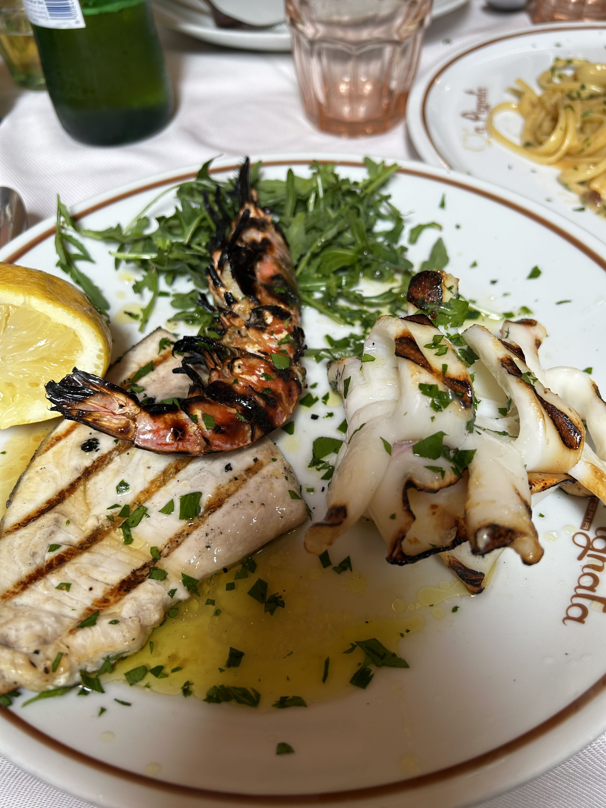
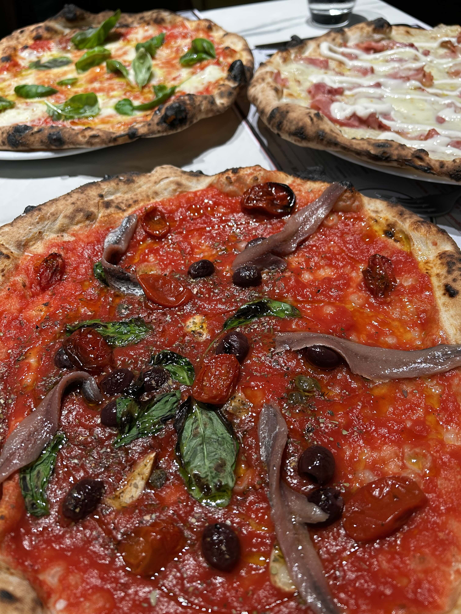

2025年3月の終わりにイタリアに行ってきました。イタリアは初めての訪問で、ローマとナポリを訪れました。ローマではコロッセオやバチカン市国、ナポリではポンペイやソレントを観光しました。記憶が薄れる前に、旅行の記録を残しておこうと思います。

### 1日目

ローマのフィウミチーノ空港に到着したのは午後8時過ぎ。行きはスイス航空チューリッヒ乗り継ぎだったので、入国審査はすでにチューリッヒで終えていました。審査は何も聞かれることなく秒で終了。夜間の長時間フライトの後だったのでこの日は空港そばのホテル[Air Rooms Rome Airport by HelloSky](https://www.airroomsromeairport.com/)に宿泊。空港からは徒歩で5分もかからなかったと思います。小さなホテルですが、モダンな内装で清潔感があり、快適でした。これだけ空港に近いのにとても静かでゆっくり休むことができました。

### 2日目

朝8時ごろチェックアウトして空港内へ。ベーカリーでサンドイッチとビザを買って朝食。イタリアではコーヒーは基本エスプレッソだけど、まだ慣れてないのでマキアートを注文。すべておいしかった。

空港からローマ市内へは、Leonardo Expressという電車で移動。空港からテルミニ駅まで直通で、所要時間は約30分。電車は快適で、車両もきれいでした。テルミニ駅に着いたら、ナポリ行きの列車までまだ時間があったので駅内のショッピングモールをぶらぶら。[Kiko Milano](https://www.kikocosmetics.com/en-jp/)でリップグロスを購入。オイル入りということで、乾燥がひどい私にはピッタリ。

その後、ナポリ行きの列車に乗車。イタリアの新幹線と言われるItalo。事前にオンラインで予約してあったので時間になったら改札の読み取り機にQRコードをかざすだけでプラットフォームに入場できました。列車は快適で、座席も広くてゆったり。ただ私たちはテーブルをはさんで２席x２席が向かい合っている席で、目の前にはカナダのバンクーバーから来たという父子が座っていました。静かでいい人たちだったのですが、やはり見知らぬ人と面と向かって座るというのは居心地悪かったです。事前に座席指定できたのかわかりませんが、ちゃんと調べるべきだったとちょっと後悔。ナポリまでの所要時間は約1時間半。途中、風景を楽しみながらあっという間に到着。

ナポリの中央駅に着いたら、すぐにホテルへ。駅の目の前にある[Starhotels Telminus](https://www.starhotels.com/en/our-hotels/terminus-naples/)。まだ正午でチェックイン時間ではなかったので荷物を預かってもらい、さっそく街歩きへ。

地下鉄1号線に乗ってToledo駅へ。ここはナポリの地下鉄の中でも特に美しい駅として知られています。まるで水中を思わせるような装飾を施された空間をエスカレータで通って駅を出ると、すでに観光客でいっぱいでした。もうお昼を過ぎていたのでまずはランチを取るためレストランへ向かいました。Toledo駅周辺は「下町」といった風情で数多くのレストランがあります。私たちは娘が事前に調べてきてくれた[Trattoria A Pignata](https://www.trattoriapignata.it/)へ。予約はしていませんでしたが幸い路上の特設テーブルに空きがあり、すぐに案内してもらえました。ウニパスタ、シーフードグリル盛り合わせ、カプレーゼ等を注文。ウニパスタは濃厚でクリーミー、シーフードグリルは新鮮でおいしかった。カプレーゼはトマトが甘くて、水牛のモッツアレラはもちもち。ナポリの食べ物はおいしいと聞いていましたが、噂通りだと思いました。

食事の後は、ナポリの街を散策。Toledo駅からVia Toledoを歩いていくと、たくさんのショップやカフェが並んでいます。途中、[Galleria Umberto I](https://www.galleriamodernartemilano.it/en/galleria-umberto-i/)という美しいアーケードを通り抜け、[Piazza del Plebiscito](https://www.naples-tourism.com/en/piazza-del-plebiscito)へ。広場は広々としていて、周囲には歴史的な建物が立ち並んでいます。特に[Palazzo Reale di Napoli](https://www.palazzorealedinapoli.beniculturali.it/)は圧巻でした。

ナポリは治安が悪いと聞いていたので、スリには厳重警戒体制でのぞみました。人混みを歩いている時に、夫が突然私を押しました。何事かと思ったのですが、なんでも見知らぬ女性が後ろから私にすっと近づいたのでとっさに押したとのことでした。私は何も気づいていなかったので、夫の反応に感謝です。

その後、中央駅に戻り、ホテルにチェックイン。６階の部屋は中庭に面しており、とても静かで快適でした。明るいうちは屋上に上がることができて、ナポリの街を一望できました。

7時からはプライベート夜景ツアー。ツアーの一環で、ナポリの名物ピザを食べることになっていました。ガイドさんが連れて行ってくれたのは[50 Kalo](https://www.50kalo.it/)というお店で、ナポリのピザの中でも特に有名な店だそうです。地元客ですでにいっぱいでしたが、すぐに入れました。ここのピザの特徴は薄いけれどしっとりとしていることらしいです。夫はとても気に入っていましたが、私はパリッとしたほうが好みなのでまあまあといったところでした。一人１枚ピザを頼むと食べきれないので箱をもらってホテルに持って帰りました。

ピザの後は、ナポリの夜景を楽しむために[Posillipo Hill](https://www.naples-tourism.com/en/posillipo-hill)へ。ここから見るナポリ湾の夜景は本当に美しかったです。ガイドさんが撮ってくれた写真も素敵でした。丘へ登る道が狭くて、運転が大変そうでしたが、ガイドさんはとても上手でした。丘の上には小さな教会もあり、夜景を楽しむために多くの人が訪れていました。私たちもそこでしばらく夜景を楽しみました。

