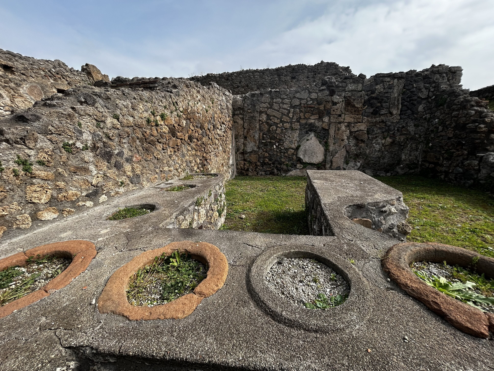
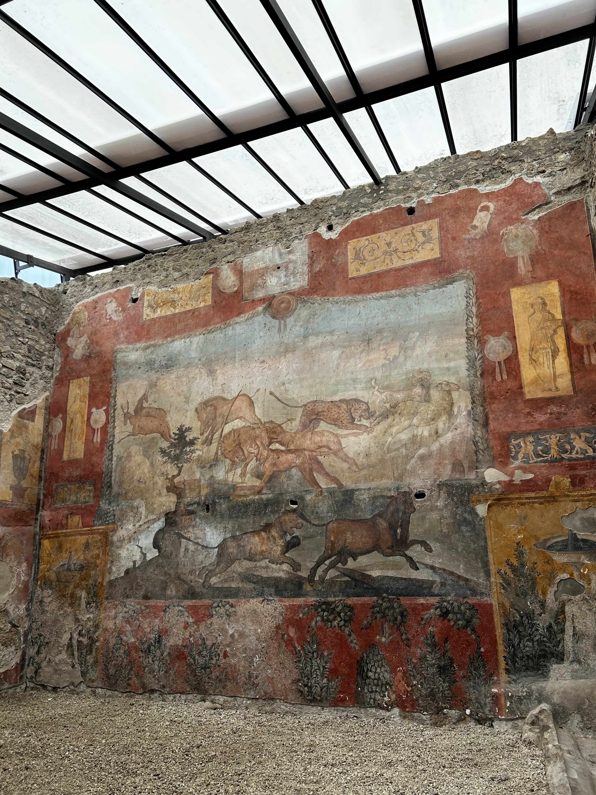
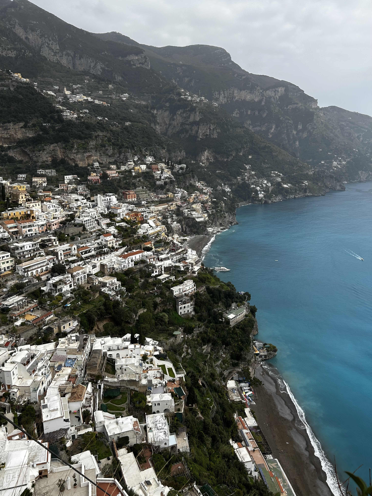
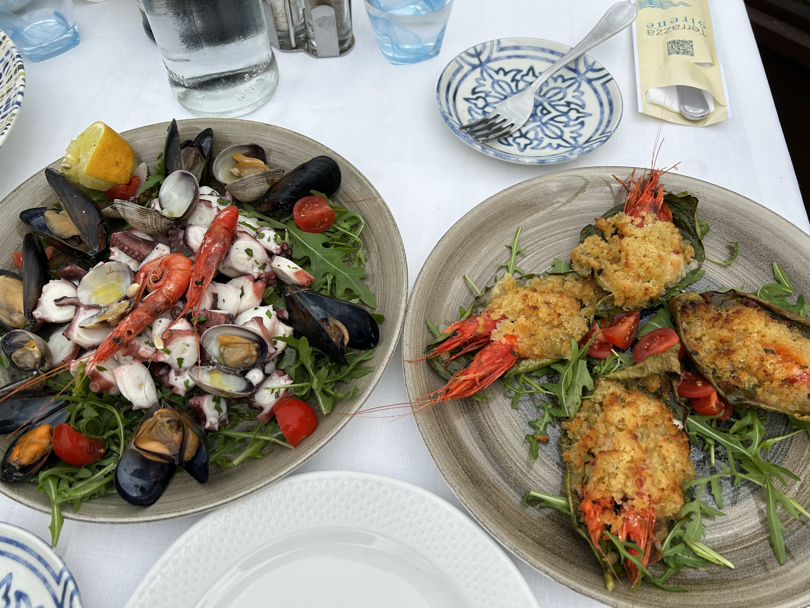
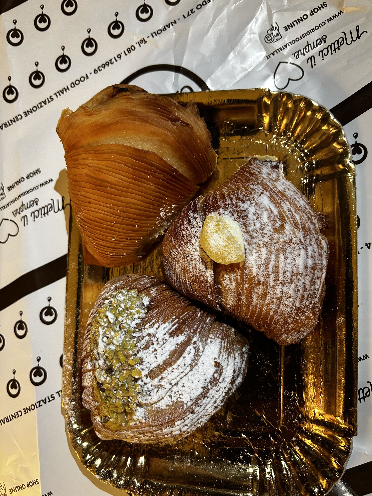

2025年3月の終わりにイタリアに行ってきました。イタリアは初めての訪問で、ローマとナポリを訪れました。ローマではコロッセオやバチカン市国、ナポリではポンペイやソレントを観光しました。記憶が薄れる前に、旅行の記録を残しておこうと思います。

### 3日目

この日はツアーに参加してポンペイ遺跡とソレントを観光する予定でした。朝食はホテルのビュッフェ。イタリアの朝ごはんは簡素とどこかで読んだことがあったけど、このホテルは種類が豊富で素晴らしかったです。特にミニサイズのクロワッサン（イタリアではコルネと呼ぶ）がサクサクで、バターの香りがたまりませんでした。プレーンの他にジャムやクリーム入りのものもあって、どれを食べるか迷いました。ナポリ名物スイーツのスフォリアテッラの小型版もあって感動しました。

ツアーの集合場所はホテルから徒歩10分弱のところにある別のホテルだったのですが、10分以上かかってしまいました。ナポリの道路は歩行者用の信号が少なくて、道路をどうやって渡ったらいいかわからなかったからです。朝のラッシュ時、車はひっきりなしで途切れないし、途方に暮れてしまいました。他の人を観察して、結局無理やり渡るしかないという結論に達しました。ナポリの人たちは車が来ていても平気で渡っていくので、私たちもそれに倣うことにしました。信号がないところは、車が一瞬途切れたときに急いで渡るのが正解のようです。

集合場所のホテルに着くと、すでに他の参加者が小型バスの中で待っていました。ツアーは現地のガイドさんが英語で案内してくれましたが、ポンペイ内部は自分たちで回ることになっていました。ポンペイ遺跡は広大で、見どころがたくさんあるので、私たちは音声ガイドをレンタルしました。レンタルする際にIDを預ける必要があるので注意です。

ポンペイ遺跡は紀元79年に火山噴火によって埋もれた街で、当時の生活様式や文化を知る貴重な遺跡です。私は小学校2年生の時に本でポンペイのことを知って以来いつか訪れてみたいと思っていました。特に印象的だったのは、保存状態の良いモザイクや壁画、そして人々の姿をそのまま残した石膏像でした。当時の人々の生活を想像すると不思議な感覚になりました。

ポンペイを後にした後、ソレントへ向かいました。バスが山沿いの細い道を走っていくと、だんだんと気分が高揚してきました。ソレントはナポリ湾に面した美しい街で、青い海と白い建物が印象的でした。

ガイドさんが案内してくれたウォーターフロントのレストラン[Terrazza delle Sirene](https://www.circolodeiforestieri.com/)でランチ。湾と遠くに山が見える絶景のテラス席に案内され、シーフードパスタなどを楽しみました。天気がよかったので、海の青さが際立っていました。食事をしながら、ソレントの美しい景色を堪能しました。景色ばかりに気を取られたのか、味のほうはあまり覚えていません。おそらくおいしかったと思いますが。

食事の後、ソレントの中心部を散策し、地元のお土産屋さんが軒を連ねる通りを訪れました。特にレモン製品が豊富で、あらゆる物がレモン柄。ガイドさんおすすめのジェラート屋さん[Primavera](http://www.primaverasorrento.it/)で名物のレモンソルベを購入。生のレモンをくり抜いた中にレモンシャーベットを入れてくれるスタイルで、インスタ映えばつぐんです。レモンの大きさによって値段が変わるのですが、中サイズでもけっこう大きかったです。レモンの酸味と甘さが絶妙で、暑い日にはぴったりでした。

ソレントの街は小さくてかわいので散策するのが楽しく、天候にも恵まれて夢のようなひと時を過ごすことができました。ツアーはここで終了し、バスに揺られてナポリのホテルに戻りました。

ホテルに戻ってから、前日から気になっていた隣のスイーツ屋さん[Cuori di Sfogliatella](https://www.cuoridisfogliatella.it/)へ行きました。ナポリ伝統のお菓子スフォリアテッラの専門店で、店内には圧倒されうほどたくさんの種類のスフォリアテッラが並んでいました。私たちはプレーンとピスタチオとカスタードを購入。お持ち帰りというとつぶれないようにとてもていねいにラッピングしてくれました。フォリアテッラはパイ生地をパリパリになるまで焼いてあり、かなり歯応えがあります。一つ食べるとお腹がいっぱいになり、この日は夕食はスキップしました。

