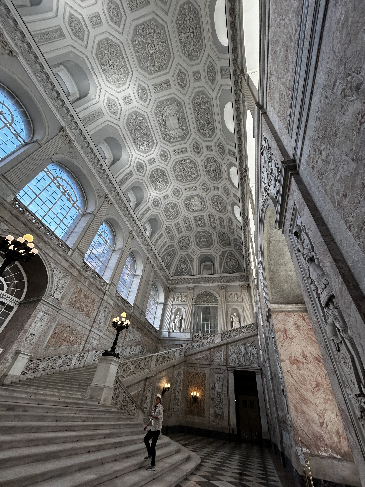
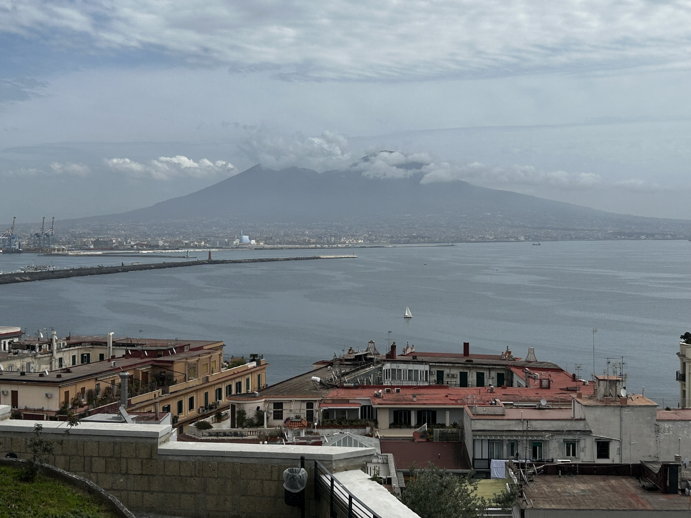
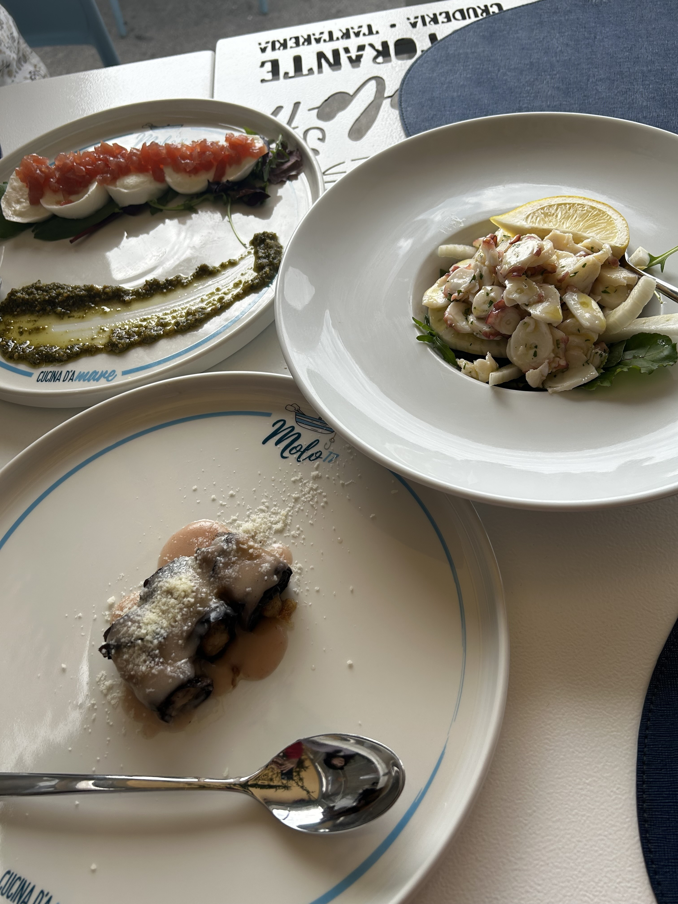
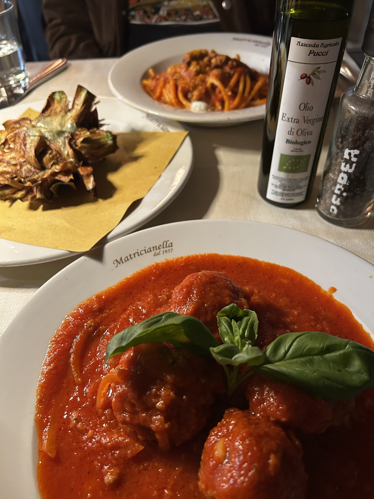
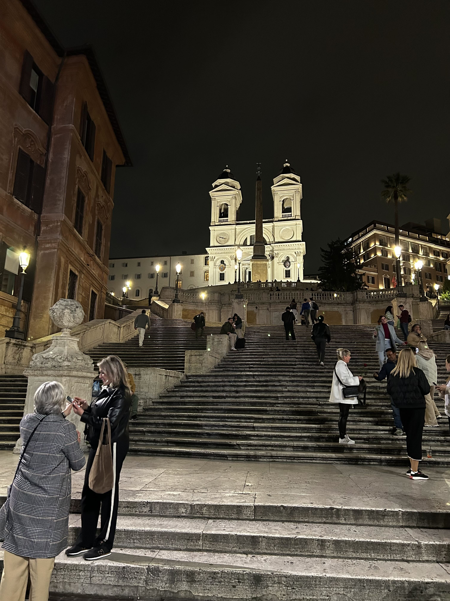

2025年3月の終わりにイタリアに行ってきました。イタリアは初めての訪問で、ローマとナポリを訪れました。ローマではコロッセオやバチカン市国、ナポリではポンペイやソレントを観光しました。記憶が薄れる前に、旅行の記録を残しておこうと思います。

### 4日目

この日は午後3時の列車でローマに戻る予定でした。午前中はナポリの街を散策することにしました。ナポリは歴史的な建物や美術館が多く、観光スポットがたくさんあります。ランチをサンタルチア地区のレストランで食べることにしていたので、その途中にあるナポリ王宮を見学しました。王宮は16世紀に建設が始まったものの、実際に国王が住むようになったのは18世紀とか。前日に約2000年前の建造物をポンペイで見た後だと18世紀がやけに最近に感じられます。内部は大理石をふんだんに使った華麗な造りで、金ピカな調度品や絵画が延々と続きます。天井画も豪華で美しく、当時の王族の生活を垣間見ることができました。王宮の見学は約1時間ほどで終了し、次はサンタルチア地区へ向かいました。

途中で有料のエレベーターにのって街を一望できる丘の上の展望所へ。ここからの景色は本当に素晴らしく、ナポリ湾とその周辺の美しい風景を楽しむことができました。

ランチは事前に調べておいたレストランの中から[Molo 17](https://molo17napoli.it/)へ。店内には誰もお客さんがいなかったのでやや不安でしたが、ここはナポリ湾を見渡せる絶景のテラス席があり、海の幸を楽しむことができる評判のレストランです。私たち前菜にタコのサラダ、カプレーゼ、ナスを使った一品を頼み、メインはパスタやタラのフライなどを注文しました。どの料理も盛り付けのセンスが抜群に素敵で、食べるのがもったいないくらいでした。景色と料理を堪能しながら、ゆったりとした時間を過ごしました。ちょっと残念だったのは、会計の時に「テーブルサービスチャージは含まれてないからその分は現金で」と言われたことです。明細を見ると明らかにチャージはついていたのですが、このウェイトパーソンのサービスは良かったし、何より料理がすばらしかったので、チップを渡しました。後で調べたところ、イタリアではチップは義務ではないけれど、サービスが良かったら渡すこともあるようです。なのですべて良し！ということで。

食事の後は、サンタルチア地区を散策しました。ここはナポリの海岸沿いにある美しい地区で、海と山が織りなす風景が印象的でした。特に、サンタルチア地区のシンボルともいえる[Castel dell'Ovo](https://www.casteldellovo.it/)は、ナポリ湾に浮かぶ小島に建つ城で、歴史的な雰囲気が漂っていました。中に入ってみたかったけど列車の時間に間に合わないといけないので、今回はあきらめてホテルへ戻りました。

ナポリのホテルで預けていた荷物を受け取り、駅へ向かいました。駅は混雑していて、列車の出発ホームを示す掲示板の周囲は人でごったがえしていました。私たちの来た時と同じItaloに乗って約1時間半の旅を経て、ローマに到着しました。

ローマのテルミニ駅からタクシーに乗ってまずスペイン広場へ向かいました。この辺りに宿泊するアパートメントの事務所があり、鍵を受け取るためです。事務所でチェックインの手続きをして、アパートメントの場所を教えてもらいました。アパートメントはスペイン広場から徒歩5分ほどのところにあり、周囲にはレストランやカフェがたくさんありました。古い建物の5階で、部屋は広くてロフト付き。キッチンも完備されていて快適でした。何よりすばらしかったのはテーブルが置かれたテラスがついていて、ここから街が見渡せる、それはそれは贅沢な空間があったことです。ここから外を眺めていると教会の鐘の音が街に響き、ローマに来たという実感がわきました。

少し休憩してから外へ夕食をとりに出かけました。アパートはVia Margutta沿いにあり、高級店が並ぶVia Del BabuinoやVia del Corsoからも近いので、ただ歩くだけでもローマの雰囲気を堪能できて楽しかったです。夕食は事前に目をつけてあったレストラン[Matricianella](https://www.matricianella.it/)へ。オープン前にもかかわらずすでに列ができていて、期待が高まりました。1957年創業ということですが、ものすごく高級ではないけどカジュアルというよりややハイエンドの部類に入ると思います。私たちは前菜にアーティチョークのフリット、メインにローマ名物のアマトリチャーナ、カルボナーラそしてミートボールを頼みました。アーティチョークは外側の葉っぱがパリパリで、中はホクホク。アマトリチャーナはトマトソースとグアンチャーレ（豚の頬肉）を使ったパスタで、濃厚な味わいが絶品でした。ウェイターさんがぶっきらぼうな感じで最初はちょっと不安でしたが、カルボナーラが忘れられていたことに気づくとあわてて謝ってくれたので安心しました。

食事を終えた後、夜のスペイン階段を散策しました。階段はライトアップされていて、幻想的な雰囲気でした。周囲には観光客や地元の人たちが集まっていて、賑やかな雰囲気でした。階段の上からはローマの街並みが一望でき、特にトリニタ・デイ・モンティ教会の美しい姿が印象的でした。

アパートへ戻る途中でティラミス専門店の[Pompi](https://barpompi.it/)に寄って、クラシックとピスタチオ味をテイクアウトして部屋で食べることにしました。四角い豆腐ほどの大きさの箱にどーんと入っていてとても迫力あります。口当たりは濃厚でクリーミー。ピスタチオのほうは悪くはないけど、残念ながらティラミスを食べているという実感が得られなくて、何か別のおいしいお菓子という感じ。ここはだんぜんクラシックの勝ちだと思いました。

