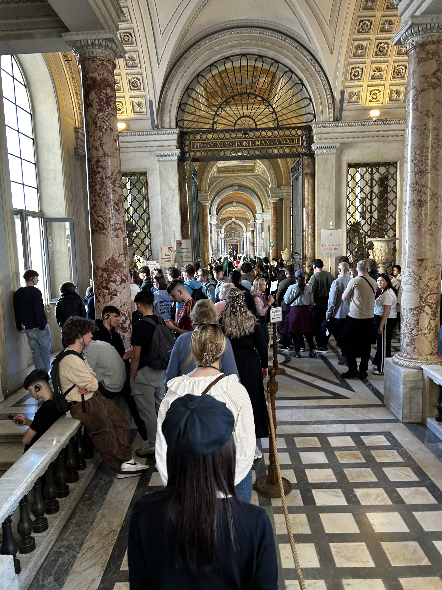
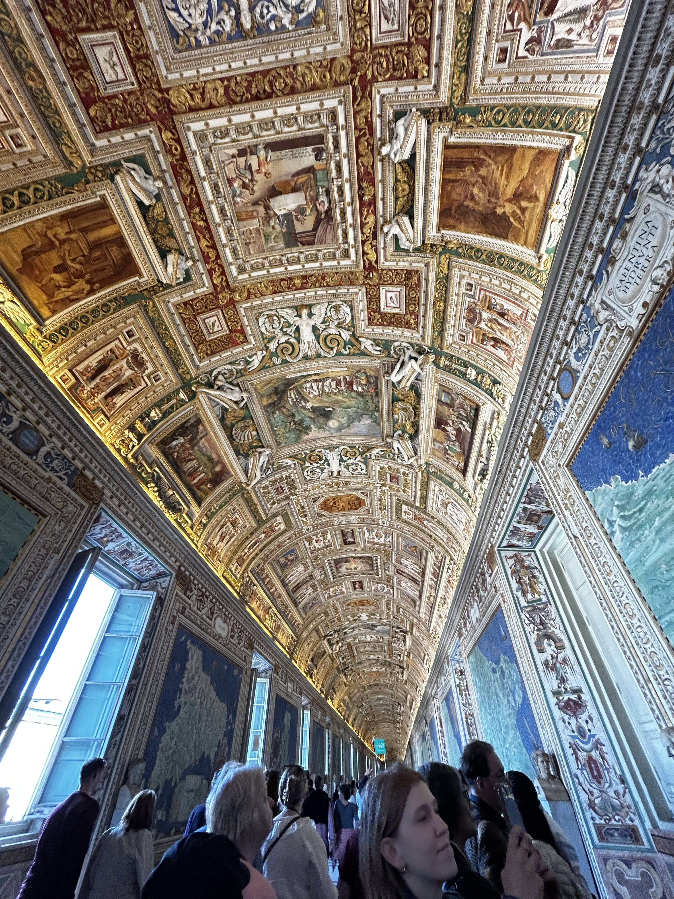
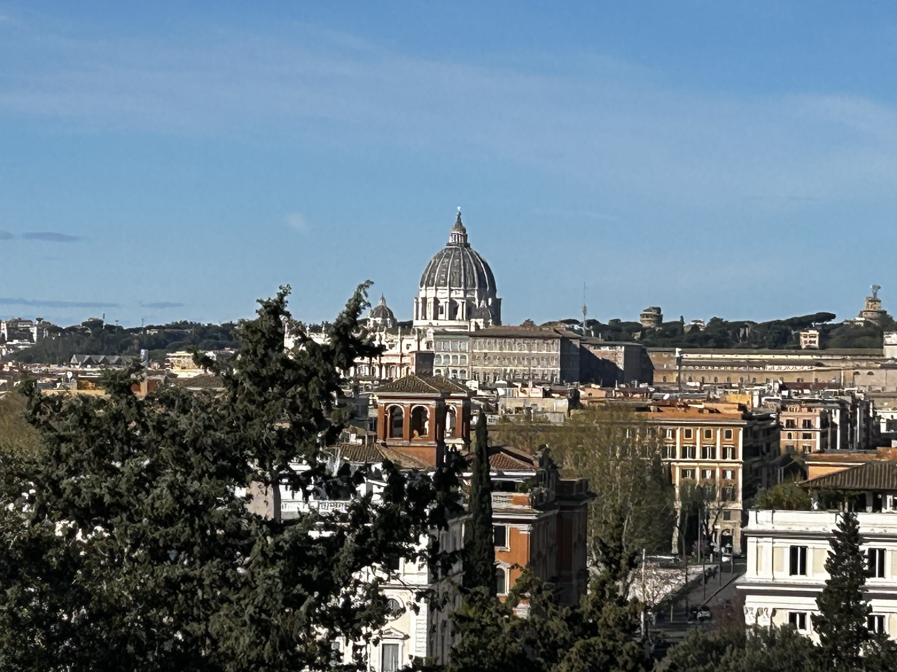
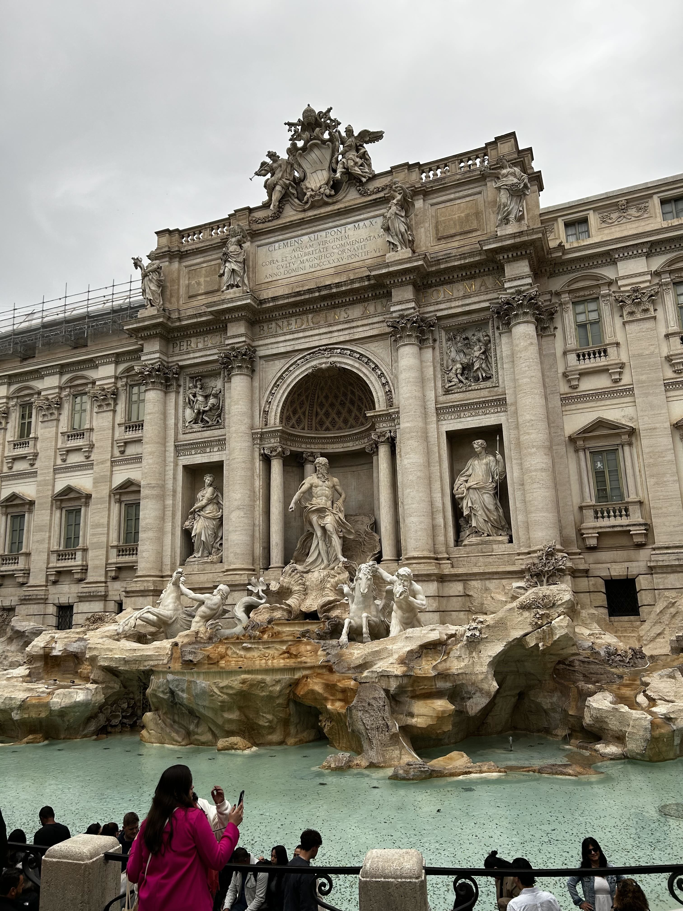
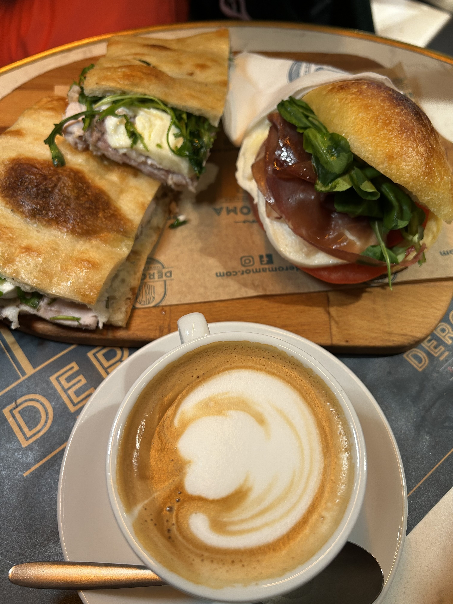
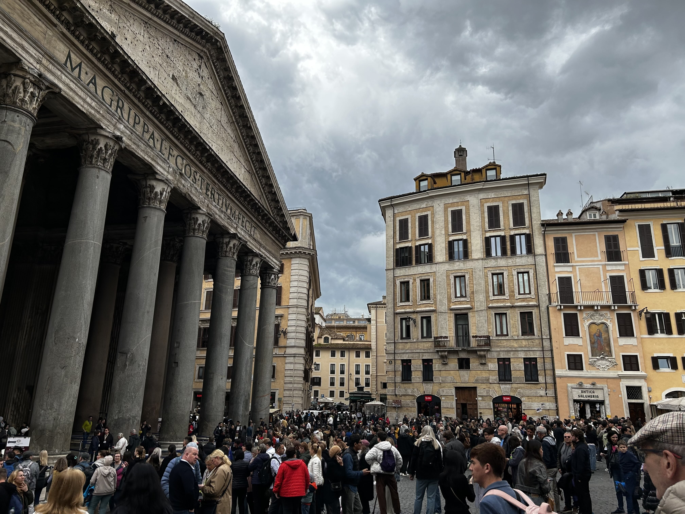

2025年3月の終わりにイタリアに行ってきました。イタリアは初めての訪問で、ローマとナポリを訪れました。ローマではコロッセオやバチカン市国、ナポリではポンペイやソレントを観光しました。記憶が薄れる前に、旅行の記録を残しておこうと思います。

### 5日目

この日は朝からバチカン観光の予定だったのですが、午前中に予約していた教皇様謁見ツアーがキャンセルとなったため、朝はゆっくり起きてコーヒーと前夜買ったティラミスの残りを朝食替わりにしてのんびり過ごしました。この日は天気も良く、アパートのテラスのテーブルに座って、周囲の古い建物のかわら屋根や教会の尖塔を眺めるのは至福のときでした。

昼前に出発して、バチカンへ向かいました。10分弱歩いてFlaminio駅からOttaviano駅まで地下鉄に乗りました。ランチを取るレストランを探すかたわら、周辺を少し歩いてみました。バチカン市国は世界最小の国であり、教皇の居住地でもあります。ローマ市内から歩いていけないこともなく、私たちが到着した頃にはすでに観光客や地元の人々が行き交っていました。

ランチをとったレストランは庶民的な街の食堂という感じで、無難にパスタとピザを注文しました。残念ながら特筆するようなものは何もありませんでした。観光客の多い場所にあるレストランは、あまり味に期待しない方が良いかもしれません。

食事の後、ツアーの集合場所に行くとすでに人でいっぱいでした。無事に自分たちのツアーを見つけ、ガイドさんと共に出発です。まずバチカン市国に入るための長い列に並び、セキュリティチェックを受けました。その後、バチカン美術館のロビーのような場所を通り、いったん中庭に出ました。中庭にあるパネルでシスティーナ礼拝堂内の説明を受けました。

バチカン美術館は世界中から集められた美術品が展示されており、全てをじっくり見るのは限られた時間内では不可能なので、初めての今回は「ベルヴェデーレのアポロン」や「ラオコーン」などの超有名作品を見逃さないことだけを目標にしました。

システィーナ礼拝堂は撮影禁止で、ガイドさんの説明を思い出しながら、じっくりと見学しました。天井画は想像以上に圧巻で、「アダムの創造」など旧約聖書でおなじみの箇所が天才ミケランジェロの手によって美しく描かれています。特に、天井の中央に描かれた「最後の審判」は迫力でした。礼拝堂内は静まり返っており、観光客たちもその神聖な雰囲気に圧倒されていました。

昨年観た映画「コンクラーベ」では、システィーナ礼拝堂の中で教皇選挙が行われる様子が描かれていましたが、実際にその場所に立つと、映画のシーンが思い出されました。映画では、教皇選挙のために集まった枢機卿たちがこの礼拝堂で議論を交わし、神の意志を求めて祈りを捧げる姿が印象的でした。

その後、サン・ピエトロ大聖堂に向かいました。大聖堂は非常に広く、すみずみまできらびやかで豪華な装飾が施されています。ここではミケランジェロのピエタ像を鑑賞するのが目的です。ピエタ像は、キリストの死を悼むマリアの姿を描いたもので、その表情や細部の彫刻が非常に美しいです。特に、マリアの顔の表情は、悲しみと安らぎが同時に感じられ、見る者の心を打ちます。

バチカン内はどこもかしこも美術品や歴史的な建物で溢れており、時間が経つのがあっという間でした。カトリック信者ではありませんが、クリスチャンの端くれとして信仰をモチーフとした数々の作品を目にすることができ、感慨深いものがありました。

### 6日目

この日は特に予定を決めず、ぶらぶら歩いて観光したりショッピングする日と決めてありました。イタリアといえば数々の有名ブランドで知られる国ですが、特に目当ての物はなく、手頃でいいものがあったら買うというスタンスで、まずはローマの中心部にある「コンドッティ通り」へ向かいました。ここは高級ブランド店が立ち並ぶ通りで、ウィンドウショッピングを楽しむには最適な場所です。季節は春ということでカラフルな服が多いのかなと思ったのですが、意外とシックな色合いの服が多かった印象です。

私は「Geox」というペネローペ・クルーズがイメージキャラクターを務めるイタリアの靴ブランドの店で、靴ではなくてジャージ素材のピーコートを購入。最近は肩こりがひどく、軽いコートが欲しかったので即決。素材が素材なので長持ちはしないと思いますが、1年を通じて涼しいベリエリアではきっと役に立つでしょう。スニーカーもお手頃価格だし色もおしゃれなので買おうか迷ったのですが、最近はスニーカーよりショートブーツをはくことが多いのでやめておきました。

娘はヨーロッパの若者向けブランドの店をかたっぱしからのぞいていましたが、結局買うのはTシャツとか「別にローマで買わなくても」という物ばかり購入。現在は日本で働いている娘。なんでも日本で買ったものはかなりの高確率で他の人とかぶるので、こういう機会に普段着を買うのだそうです。

その後、コンドッティ通りを抜けて「スペイン広場」へ。広場の真ん中には「トリニタ・デイ・モンティ教会」があり、その前にある「スペイン階段」は観光名所として有名です。階段は長いので、上まで登るのは大変ですが、上からの眺めは素晴らしいです。広場の周りにはカフェやレストランがたくさんあり、観光客で賑わっていました。

私たちはさらに歩いてトレビの泉へ。トレビの泉はローマのシンボル的存在で、観光客がコインを投げ入れる姿が印象的です。コインを投げることで再びローマに戻ってくることができると言われています。私たちはコインをあいにく持っていなかったので、投げ入れることはできませんでしたが、泉の美しさに感動しました。トレビの泉は夜になるとライトアップされ、幻想的な雰囲気になります。夜に行きたかったのですが、今回は断念。

ここでランチを取るためにたまたま近くにあったカフェに入りました。カウンターに様々な種類のピザが並んでいるローマでよく見かけるタイプのお店。私はただコーヒーを飲んで一休みしたかったので何も期待していなかったのですが、娘が注文したポークのサンドイッチが絶品でした。ポークはローズマリーで柔らかくマリネされており、パンも香ばしく焼かれていて、シンプルながらも忘れられない味でした。今回の旅行で食べた物の中でベストと言えるほどの美味しさでした。

後で写真を見返してみてわかったのですが、このお店は「Deroma」という名前でした。カウンターは混雑していて、後から来たお客さんが先に注文しようとすると、お店のお兄さんは「こっちの人が先」と言って、私たちを優先してくれたのでこのお店の印象はとてもいいです。イタリアの人は一般的にフレンドリーで、観光客にも優しいと思います。

ランチを終えて、そこからさらに歩いてデパートの「リナシェンテ」に行きました。ここはブランド店も入っているデパートで、ファッションやコスメ、雑貨などが揃っています。混んでいるだろうと予想していたのですが、そうでもなくて、各階をゆったり見て回ることができました。せっかくイタリアに来たのだから何か記念に買いたいと思っていたのですが、特に目を引くものはなく、結局「Maje」というフランスのブランドでニットのポロシャツを購入。娘は化粧品などを買っていました。イタリアの低価格帯化粧品は日本でもアメリカでもあまり見かけないので、いいお土産になります。

その後、デパートを出て「ナヴォーナ広場」へ。広場はバロック様式の建物に囲まれた美しい場所で、噴水やカフェがあり、観光客や地元の人々で賑わっています。広場の中心には「四大河の噴水」があり、その周りにはストリートパフォーマンスをする人たちがいて、楽しい雰囲気でした。

娘が行きたいというので[Mr.100 Tiramise](https://www.facebook.com/Mr100Tiramisu/)というティラミス専門店に行きました。ここはティラミスの種類が本当に100あります。驚いたことにワインも提供していて、ワインを飲みながらティラミスを食べている人がけっこういました。カウンターでは従業員たちが次から次へとティラミスを作っているのが見えます。トッピングも選べるので注文をさばくのが大変そうです。席はすべてうまっていたので、私たちはひとつテイクアウトして、外で立ち食いしました。ティラミス好きだったらぜひ行ってみてください。

この後パンテオンに寄りました。入場券の窓口に長い列ができていたので迷いましたが、せっかくきたので列に並んで入場しました。パンテオンは古代ローマの神殿で、現在は教会として使用されています。内部は非常に広く、ドームの天井には大きな穴が開いていて、光が差し込んでいます。ドームの中央には「オクルス」と呼ばれる穴があり、雨が降ると水が流れ込む仕組みになっています。雨水は床に流れ込み、排水口から外に流れ出るようになっています。この独特なデザインは、古代ローマの建築技術の高さを示しています。

パンテオンを出た後、アパートに戻り夫と合流しました。夕食はアパートから一番近くのレストラン[Edy](https://www.facebook.com/edyristorante/)でパスタなどを食べました。この店は通りから入った目立たないところにあるものの、すでに地元の人とおぼしき人たちで賑わっていました。予約はしてなかったものの幸いすぐに案内されました。メニューはオーセンティックなイタリアンで、パスタやピザ、肉料理などが揃っています。私たちはそれぞれ好きなものを頼みましたが、どれも美味しかったです。

