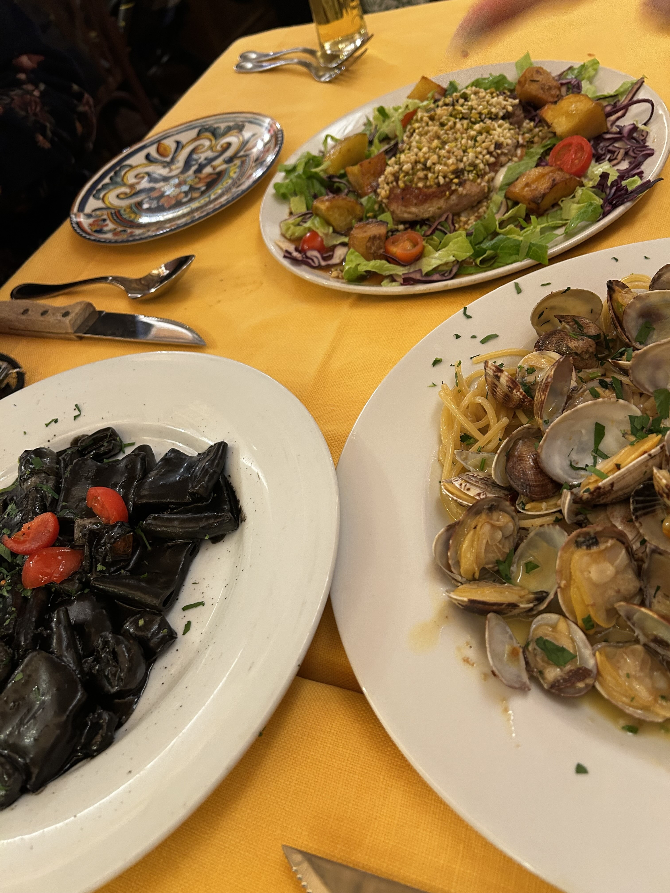

2025年3月の終わりにイタリアに行ってきました。イタリアは初めての訪問で、ローマとナポリを訪れました。ローマではコロッセオやバチカン市国、ナポリではポンペイやソレントを観光しました。記憶が薄れる前に、旅行の記録を残しておこうと思います。

### 7日目

この日は朝からコロッセオのツアーに参加する予定でした。あいにくの天気で小雨が降っていました。コロッセオはローマのシンボル的存在で、古代ローマ時代の闘技場として知られています。昨年、映画「グラディエーター２」を観て、今回の旅で最も楽しみにしていた場所です。ツアーは日本語のガイドさんがついてくれました。

まずその大きさに圧倒されました。写真で見るよりはるかに大きいです。2000年も前にどうやってこのような壮大な建築物を作ったのでしょうか。本当にすごいです。東京ドームと同じく5万人収容できたそうですが、人間の叡智と技術ってすごいですね。コロッセオの中に入ると、当時の人々がどのようにしてこの場所で戦ったのかを想像しながら、ガイドさんの説明を聞きました。コロッセオはただの闘技場ではなく、古代ローマの文化や歴史を感じることができる場所でした。

自分たちのペースでゆっくり見学するため、ツアーではなく個人でチケットを買おうかとも考えたのですが、結局ツアーに参加して正解でした。まず、コロッセオは常に混んでいます。どこの空間も人でいっぱいなので、自分で見どころポイントをさがそうとすると、人がじゃまになって難しいし、人の流れに乗って移動しているうちにうっかり見逃す可能性も高いと思います。ガイドさんがいればそういう心配もないし、いい写真が撮れるポイントも教えてくれます。

コロッセオの後はお隣のフォロ・ロマーノへ移動しました。ここは古代ローマの遺跡で、かつての政治や商業の中心地でした。コロッセオと同様に、ここも広大な敷地に数多くの遺跡が点在しています。ガイドさんの説明を聞きながら、古代ローマの人々がどのように生活していたのかを想像しました。特に「元老院」の跡地は印象的で、当時の政治がどのように行われていたのかを感じることができました。

その後、パラティーのの丘に登りました。ここからはフォロ・ロマーノ全体を見渡すことができ、古代ローマの壮大さを実感しました。丘の上には「アウグストゥスの家」と呼ばれる遺跡があり、当時の皇帝が住んでいた場所とされています。ここからの眺めは本当に素晴らしく、ローマの街並みを一望できました。小雨が降り続いており、あまりいい写真は撮れませんでしたが、丘の上からの景色は本当に美しかったです。

ツアーを終えた私たちはランチを食べるために近くの中華料理レストランを訪れました。ローマで中華というのもへんですが、さすがにパスタばかりでちょっと飽きてきたのでイタリアンは一休みです。ローマで食べた中華料理は可もなく不可もなく、それなりに美味しかったです。

その後、「猫の聖域」といわれる古代遺跡「トッレ・アルジェンティーナ広場」に行きました。ここは猫好きにはたまらないスポットで、紀元前といわれる遺跡の中にたくさんの猫がいる、はずでした。あいにくの雨で、見ることができたのは３匹だけ。ここには野良猫、捨て猫を保護するセンターが併設されており、200匹以上になることもあるそうです。たくさんの猫たちが遺跡でくつろぐ姿を見たかったです。ちなみにここはユリウス・カエサルが暗殺された場所ではないかとも言われています。

そしてその後、さらに歩いているうちに美しい教会[Basilica di Santa Maria Sopra Minerva](https://www.santamariasopraminerva.it/en/)があったので入ってみました。中に入って驚きました。濃紺の天井と数々の装飾の美しさ。知らずに入った教会でしたがミケランジェロの彫刻「キリストの復活」がある教会でした。教会の中は静まり返っていて、観光客も少なく、ゆっくりと見学することができました。特に天井の青い色合いが印象的で、まるで夜空を見上げているような気分になりました。教会の中には美しいステンドグラスや彫刻があり、どれも素晴らしいものでした。

夜はスペイン広場近くのレストラン[Ristorante al 34](https://www.ristoranteal34.it/eng/)に行きました。時間が7時前だったので、予約なしでかろうじて座れました。前菜としてアーティチョークの盛り合わせとスップリを注文しました。アーティチョークのほうはローマ風、フライ、グリル、マリネの４種類の調理法で出てきました。どれも美味しかったですが、特にフライが絶品でした。スップリはローマ風のライスコロッケで、外はカリッと、中はクリーミーな食感が楽しめました。メインはイカ墨のパスタとボンゴレを頼みましたが、どれも美味しかったです。ウェイターさんも気さくで、すばらしいひとときを過ごすことができました。

