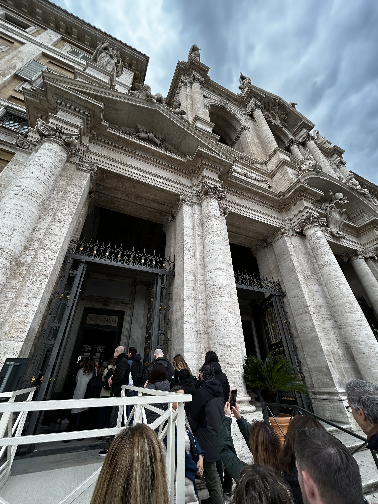
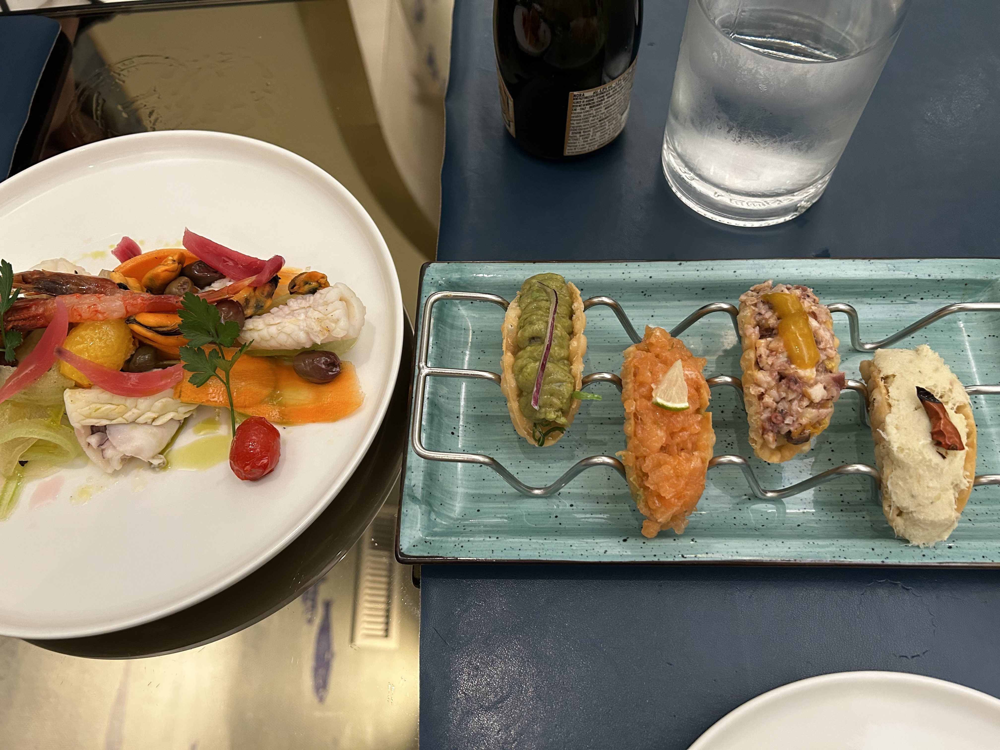

2025年3月の終わりにイタリアに行ってきました。イタリアは初めての訪問で、ローマとナポリを訪れました。ローマではコロッセオやバチカン市国、ナポリではポンペイやソレントを観光しました。記憶が薄れる前に、旅行の記録を残しておこうと思います。

### 8日目

いよいよ最終日です。翌日には帰ります。朝、地下鉄でテルミニ駅まで行き、駅近くのカフェで朝食をとりました。そして[Basilica of Saint Mary of the Angels](https://www.santamariadegliangeliroma.com/en/)を訪れました。外側のシンプルな外観とは裏腹に、内部は非常に美しい装飾が施されています。ミケランジェロがデザインしたと言われていますが、特に天井のフレスコ画は圧巻で、まるで空を飛んでいるかのような感覚を味わえました。

その後、少し歩いて[Basilica Papale di Santa Maria Maggiore](https://www.basilicasantamariamaggiore.va/en.html)に行きました。ここはローマで最も重要な教会の一つで、先ごろ亡くなったフランチェスコ教皇が眠る場所でもあります。私が訪れたときはまだご存命でしたが、たくさんの人が訪れていました。今はもっと多くの人が教皇様にお別れを言うために訪れているのではないでしょうか。

ひとしきり教会を見学した後、ローマ観光もかねてサンタンジェロ城を目指してひたすら歩きました。しかし、パンテオンあたりで激しい雨にみまわれ、しかたなくカフェに避難しました。雨が止むのを待っている間、カフェでコーヒーとティラミスをいただきながら、娘としばしおしゃべり。普段離れて暮らしているので、こういう時間がとても貴重です。1時間近くたってやっと雨が止んだので、外へ出ました。しかしもうサンタンジェロ城まで行く元気はなくなってしまい、ナヴォーナ広場でベルニーニの四大河の噴水を見て、アパートに戻ってきました。

しばらく休憩してから夕食のためにでかけました。行き先は特に決めていなかったので、適当に歩いて良さそうなレストランに入りました。お店の名前は[Pesciolino](https://pesciolino.eu/en/)。モダンなインテリアのシーフードレストランです。前菜にサーモン、タコ、ガカモレ、タラのタコス、セビーチェ、シーフードフライを頼み、メインはトマトソースのパスタを頼みました。イタリアンとメキシカンを合わせたような料理で、盛り付けがとてもセンスがよかったです。

帰りに娘がジェラート屋さんでカップに大盛りのジェラートを買ったので、皆で分けて食べました。

### 9日目

この日の午後のフライトでついに帰国です。この日は朝からとてもいい天気だったので、ポポロ広場横の公園に行ってみました。公園は少し高いところにあり、ポポロ広場の向こうにバチカンが見渡せます。旅の最後にすばらしい眺めを楽しむことができました。

朝食としてアメリカにも店を出しているフローレンス発の有名サンドイッチ[All'Antico Vinaio](https://www.allanticovinaiousa.com/)でサンドイッチを買って、アパートのテラスで食べました。ここのサンドイッチを食べるのは初めてでしたが、フォッカチャにたっぷりの具材が挟まっていて、ボリューム満点でとても美味しかったです。正直いって今回のイタリア旅行ではパスタよりサンドイッチのほうが私は好きでした。アパートのテラスからの絶景もこれでお別れ。寂しさを感じながら荷物をまとめてアパートを出発しました。

